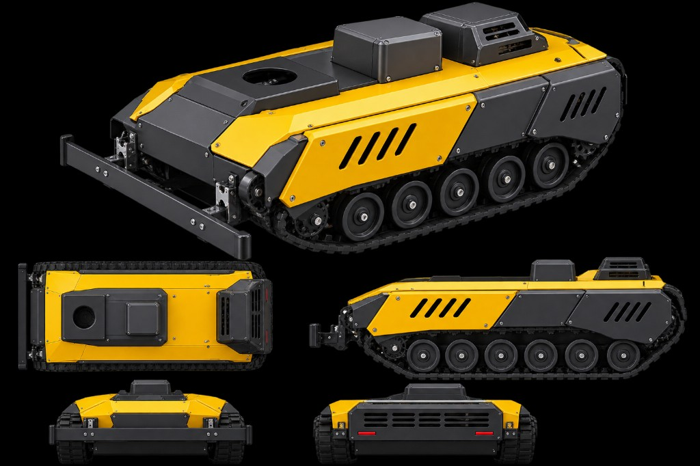
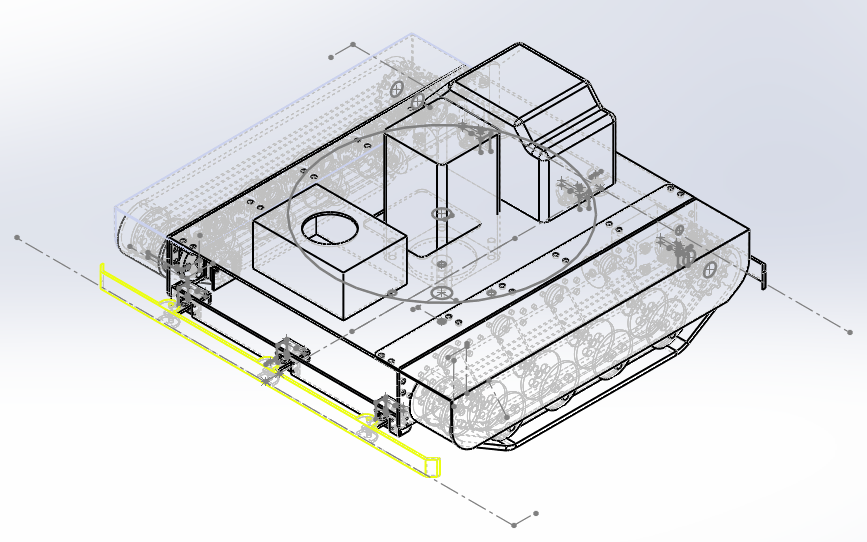
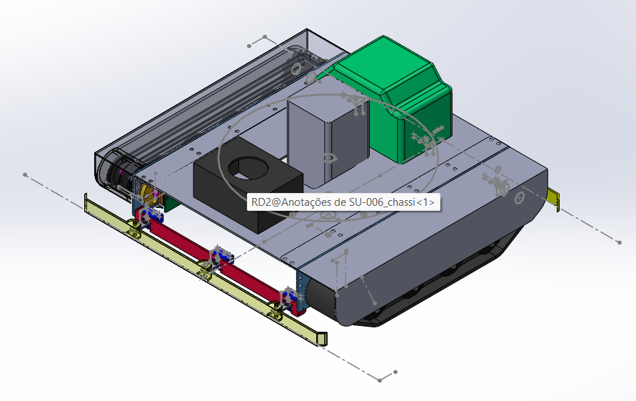

# Especificação mecânica — SU-006

**Peça-base:** `SU-006_chassi`  
**Vista de anotações no CAD:** `RD2@Anotações de SU-006_chassi<1>`  
**Público:** projetistas mecânicos, detalhamento, fabricação e integração de sensores  
**Data:** setembro de 2026  
**Status:** CAD de conceito / envelope — cotas numéricas ainda não congeladas neste pacote

Este documento descreve o veículo **visto nos renders e no conjunto SolidWorks**, e o que o time de navegação inercial precisa receber de volta. Onde a cota não aparece no desenho, está **TBD**. Não inventar número para fechar BOM.

Documentos irmãos: `docs/01-documentacao-tecnica-software.md`, `docs/02-documentacao-tecnica-mecanica.md` (requisitos do firmware, tração diferencial), `docs/05-linha-de-negocio-mecanica-SU-006.md`.

---

## 1. Identificação do conjunto

| Item | Valor |
|------|--------|
| Família | UGV de esteira, carenagem industrial amarela / cinza |
| Chassi | `SU-006_chassi` |
| Anotação ativa | RD2 (vista isométrica com linhas de centro e cota de largura frontal) |
| Tração | Esteiras independentes (skid-steer), **não** eixo diferencial de duas rodas |
| Função no sistema INS | Plataforma física do mapa 2D, IMU, scan IRDA/ToF e bumpers |



*Figura 1 — Envelope externo: isométrica, planta, lateral, frente e traseira.*



*Figura 2 — Conjunto transparente. Destaque amarelo: cota de largura do para-choque / face dianteira. Linhas de centro no plano do chassi.*



*Figura 3 — Chassi cinza, para-choque amarelo, longarinas vermelhas, cubo de sensor preto, volume central, módulo verde (eletrônica / térmica), esteiras.*

---

## 2. Arquitetura mecânica

O veículo é um **casco baixo e largo** com:

1. **Deck estrutural** (`SU-006_chassi`) — placa superior com grade de furos e três volumes de payload.  
2. **Dois conjuntos de esteira** — caixas laterais com ~7 rodas de apoio, roda motriz e tensor.  
3. **Implemento dianteiro** — barra transversal (para-choque / lâmina leve) em três apoios.  
4. **Carenagem** — painéis aparafusados, frestas de ventilação laterais e grade traseira.

```
        [barra dianteira / bumper]
                 │  3 apoios
    ┌────────────▼──────────────────────────────────┐
    │  cubo ótico     volume    módulo térmico      │  deck
    │  (furo Ø)       central   (verde no CAD)      │
    │                 IMU TBD                       │
    ├───────────┬──────────────────────┬────────────┤
    │  esteira  │      bateria /       │  esteira   │
    │  E        │      harness         │  D         │
    └───────────┴──────────────────────┴────────────┘
                         ▼
                    grade + luzes
```

**Implicação para o software:** o firmware e o `docs/02` assumem **duas rodas** e bitola. Este chassi é **skid-steer em esteira**. O projetista deve entregar a cinemática equivalente (ver §8), não forçar o modelo de roda livre.

---

## 3. Subsistemas

### 3.1 Chassi (`SU-006_chassi`)

Observado no CAD:

- Deck plano, simétrico em Y, com **linhas de centro** na vista RD2.  
- Padrão de furos no perímetro (tampas e carenagem).  
- Espessura aparente de chapa estrutural (soldada ou parafusada às caixas de esteira).  
- Três volumes rígidos no topo — não são “tampas soltas”: tratar como envelopes de payload.

Entregar no próximo pacote CAD:

| Entregável | Por quê |
|------------|---------|
| Comprimento × largura × altura (envelope) | Logística, rampa, porta, container |
| Massa do chassi nu e CG | Estabilidade e IMU |
| Espessura de chapa, material, tratamento | BOM e solda |
| Tabela de furos (Ø, passo, tolerância) | Carenagem e sensores |
| Origem do modelo (0,0,0) vs. centro de giro | Software de pose |

Origem recomendada para o time INS: **centro geométrico entre as duas esteiras, no plano do deck**, eixo X para frente, Y para a esquerda, Z para cima. Confirmar no SolidWorks e publicar um sketch `CSYS_NAV`.

### 3.2 Esteiras e trem de força

Vista lateral do render: esteira contínua, **sete rodas de apoio** pretas, roda dianteira e traseira de maior diâmetro (típico: tensor + sprocket). Motor visível na **traseira esquerda** do CAD colorido (cilindro no interior da caixa).

Requisitos de detalhamento:

- Um motor + redutor **por lado** (skid-steer). Sentido: frente = ambos os lados mesmo RPM; giro = lados opostos.  
- Encoder **por eixo de sprocket** (não na roda de apoio). Folga de esteira não pode entrar na contagem.  
- Tensor acessível sem desmontar a carenagem amarela.  
- Folga de esteira: especificar curso do tensor e carga de pré-tensão (**TBD**).  
- Proteção de pedra / grama entre a esteira e o deck (saia interna).  
- Ponto de içamento ou cavalete: o laboratório precisa **esteiras no ar** para teste de motor (mesmo critério do README de bancada).

Constante que o firmware precisa (equivalente ao `mm_por_pulso` das rodas):

```
mm_por_pulso = (π · D_sprocket_primitivo) / (PPR · redução · modo_quadratura)
```

`D_sprocket_primitivo` é o diâmetro primitivo da roda motriz **no passo da esteira**, não o diâmetro externo da borracha. Medir no CAD e validar com trena em 10 voltas.

Bitola efetiva = distância entre **centros das esteiras** (não a largura externa). Wheelbase de esteira = distância sprocket–tensor. Ambos **TBD**.

### 3.3 Para-choque / implemento dianteiro

No CAD colorido:

- Barra amarela transversal, seção tubular / perfil.  
- Três longarinas vermelhas para trás, com **brackets azuis** (parafusos visíveis).  
- A cota amarela da Figura 2 cobre **toda a largura da barra** — esta é a cota crítica de envelope frontal.

No render:

- Barra preta, dois tirantes diagonais para o casco.  
- Folga ao solo visível (a barra não é lâmina de corte rente ao chão).

Função de projeto (fechar uma):

| Opção | Uso | Consequência |
|-------|-----|----------------|
| A — Bumper de contato | Alimenta zonas FRONT / FRONT_LEFT / FRONT_RIGHT | Microswitches nos 3 apoios; curso 3–8 mm |
| B — Lâmina / empurrador | Empurra detrito, não corta | Sem encoder de lâmina; ainda precisa de bumper atrás da barra |
| C — Hitch de implemento | Ferramenta trocável | Interface de pinos padronizada; massa extra no CG |

**Não** tratar esta barra como a lâmina de corte do firmware (`blade_motor_status`). Corte, se existir, fica **abaixo do casco**, isolado da IMU.

Se a barra for bumper: os três apoios mapeiam bem para FRONT_LEFT / FRONT / FRONT_RIGHT. O firmware espera **oito zonas**; laterais e traseira continuam na carenagem (§5).

### 3.4 Cubo ótico (volume preto com furo circular)

Posição: deck dianteiro, deslocado para bombordo na planta (Figura 1). Furo circular no topo, no CAD com divisão em três setores (janela / tampa / sensor).

Interpretação de projeto (escolher e congelar):

1. **Poço de LiDAR / ToF rotativo** — alinha com o simulador (varredura 180°–360°, 30 Hz, passo 1,8°).  
2. **Passagem de câmera / gimbal** — então o IRDA precisa de outro envelope.  
3. **Bocal / payload de cliente** — reservar, não furar a ótica.

Se for torreta IRDA/ToF (recomendado para o INS):

- Centro do furo = origem polar do scan. Publicar offset X/Y/Z até `CSYS_NAV` em mm.  
- Altura do eixo óptico ao solo **TBD** (faixa útil ToF: 50–2000 mm; evitar ver a esteira).  
- Tampa com janela IR-transparente ou recorte; interior fosco.  
- Cabo em laço de serviço se houver rotação.  
- IP: volume seco separado do deck molhado.

### 3.5 Volume central (cinza)

Prisma retangular entre o cubo ótico e o módulo verde. Candidato a:

- IMU + STM32 (rígido ao chassi), **ou**  
- Bateria / BMS (então a IMU **não** pode ir aqui se houver flexão da tampa).

Regra: a IMU BNO080 vai em **base metálica rígida**, o mais perto possível de `CSYS_NAV`, longe do motor da esteira e do H-bridge. Se este volume for bateria, criar um **pad de IMU** parafusado no deck, não na tampa do volume.

### 3.6 Módulo verde (térmica / eletrônica)

No CAD: sólido verde, perfil trapezoidal, coincidente com a caixa ventilada do render (grelha no topo traseiro).

Tratar como **compartimento de potência**:

- L298N (ou driver de esteira de maior corrente) + Raspberry Pi + STM32, **ou** só potência se a lógica for no volume central.  
- Entrada de ar: grelha superior + frestas laterais da carenagem (5 fendas diagonais no painel amarelo, 5 no quarto traseiro cinza).  
- Saída: grade horizontal traseira.  
- Motores de esteira **não** compartilham o 5 V do Pi. GND comum. Fusível no `Vs`.  
- Dissipação: o L298N em 12 V contínuo esquenta; este módulo precisa de caminho de ar real, não só fenda estética.

### 3.7 Carenagem

- Painéis amarelos laterais aparafusados (muitos parafusos visíveis → manutenção de campo).  
- Quarto traseiro cinza, capô dianteiro cinza inclinado.  
- Traseira: duas luzes / catadióptricos vermelhos, painel central, grade de ventilação.  
- Fendas laterais: não apontar jato de água direto no ToF / IMU. Defletor interno ou labirinto.

Acabamento de produto (render): amarelo industrial + cinza escuro. Pintura: especificar código (ex. RAL 1003 / RAL 7016) **TBD**, camada em zonas de esteira (cascalho).

---

## 4. Integração com o sistema de navegação

O software localiza o veículo **sem GPS contínuo**: IMU BNO080 + encoders + bumpers + distância (IRDA/ToF). A mecânica define se isso converge ou deriva.

### 4.1 IMU (BNO080)

| Requisito | Valor |
|-----------|--------|
| Barramento | I2C1, PB6 SCL / PB7 SDA, 100 kHz, ADDR 0x4A |
| Montagem | Rígida, nivelada com o plano das esteiras |
| Isolamento | Silent-block leve; macio demais atraso de heading |
| Afastar de | motores de esteira, lâmina (se houver), L298N |
| Entregar | foto + STEP + desvio de planaridade |

### 4.2 Scan de distância

Dois conceitos no software — o SU-006, pelo furo circular, favorece a **torreta**:

| Conceito | Hardware | Status no código |
|----------|----------|------------------|
| 4 ToF fixos FRONT/REAR/LEFT/RIGHT | furos na carenagem | `irda_distance[4]` em cm |
| 1 ToF/LiDAR em torreta | cubo ótico Ø | simulador 30 Hz, 200 pts/volta |

Se 4 ToF fixos: altura 80–150 mm do solo (TBD em campo), eixo horizontal, sem ver a esteira.

### 4.3 Bumpers (8 zonas)

O firmware indexa `Direction`: FRONT, REAR, RIGHT, LEFT, FRONT_RIGHT, FRONT_LEFT, REAR_RIGHT, REAR_LEFT. **RIGHT** alinha na borda.

No SU-006:

- Dianteira: 3 apoios da barra → 3 zonas.  
- Laterais: palhetas na carenagem, **fora** da esteira (a esteira não pode ser o bumper).  
- Traseira: saia abaixo da grade, sem bloquear o ar.

Curso 3–8 mm antes do batente rígido. Microswitch NF → GND, 3,3 V. **Não usar PC13** na Blue Pill para REAR_LEFT.

### 4.4 E-stop e acesso

- Cogumelo acessível no capô traseiro ou lateral, sem deitar sobre implemento.  
- NC independente do Pi: STM32 zera os IN da ponte H.  
- Tampa do módulo verde: acesso a Pi (SSH), SWD do STM32, fusível.

---

## 5. Envelope, massas e o que falta cotar

A vista RD2 já tem a **cota de largura da barra dianteira** (Figura 2). Publicar o valor no próximo PDF de detalhamento.

Lista mínima para congelar o modelo:

| Cota | Uso |
|------|-----|
| Largura da barra (já em RD2) | Envelope e bumper |
| Largura externa (esteira a esteira) | Porta / rampa |
| Comprimento total com barra | Giro e mapa |
| Altura do deck e da carenagem | CG e IMU |
| Largura e passo da esteira | Fornecedor |
| Diâmetro primitivo do sprocket | mm/pulso |
| Distância entre centros das esteiras | bitola / giro |
| Offset cubo ótico → CSYS_NAV | mapa polar |
| Offset IMU → CSYS_NAV | fusão |
| Curso do bumper | GPIO |
| Massa total e CG (X,Y,Z) | rampa e deriva |
| IP alvo (sugerido IP54 casco / IP65 ótica) | vedação |

Célula do simulador desktop: 1,41 m × 1,41 m. Se o SU-006 for maior que isso, o teste indoor muda — avisar o software.

Histerese de “área fechada” no firmware: retorno a **< 20 cm** do ponto inicial após 15 s. Um casco muito longo **nunca fecha** o perímetro. Se o comprimento do SU-006 for da ordem de 1 m ou mais, essa constante precisa ser revista **junto** com o software — não “cabe” só na mecânica.

---

## 6. Materiais, fabricação e montagem

### 6.1 Intenção de processo (a confirmar no CAD de produção)

| Subconjunto | Processo típico |
|-------------|-----------------|
| Deck / caixas de esteira | Chapa dobrada + solda, ou usinado + parafuso |
| Carenagem | Chapa fina parafusada ou plástico injetado / rotomoldado em série |
| Barra dianteira | Tubo / perfil soldado, pintura |
| Rodas de apoio | Compra (rolamento + PU) |
| Esteira | Compra (borracha com talões) |

Solda no casco: controlar empeno do deck — o pad da IMU não pode ficar com 2–3° de cunha (vira gravidade na aceleração horizontal).

### 6.2 Sequência de montagem sugerida

1. Caixas de esteira + sprocket + encoder + tensor.  
2. Deck ao par de caixas; verificar paralelismo das esteiras.  
3. Pad IMU + CSYS_NAV.  
4. Motores, harness, fusível, e-stop.  
5. Cubo ótico e offset.  
6. Barra dianteira e switches.  
7. Carenagem, frestas, luzes.  
8. Cavalete: esteiras no ar, teste de sentido de motor **antes** de PWM em chão.

### 6.3 Manutenção de campo

- Tensionar esteira sem tirar o painel amarelo inteiro.  
- Trocar esteira com o veículo içado pelos furos de cavalete.  
- Acesso à bateria pelo módulo verde ou tampa central.  
- Parafusos da carenagem: um padrão de cabeça (ex. M5 inox) para não misturar kit.

---

## 7. Ambiente e segurança

- Poeira, água, grama, pedra na esteira. Conectores com trava.  
- Cabos de encoder e I2C **longe** dos pares de potência da ponte H.  
- Primeiro teste em piso plano (o simulador assume plano). Rampa exige fusão IMU + encoder.  
- E-stop corta tração mesmo com Pi travado.  
- CG baixo: esteira larga ajuda; bateria no fundo do casco, não no módulo alto verde.  
- Se houver lâmina de corte no futuro: guarda normativa, interlock, bumper **antes** da ferramenta.

---

## 8. Conflito explícito com o firmware atual

O repositório hoje modela **tração diferencial de duas rodas**. O SU-006 é **esteira skid-steer**.

O que o projetista deve devolver para o software não quebrar:

1. `mm_por_pulso` por esteira (medido no sprocket).  
2. Bitola entre centros das esteiras.  
3. Fator de escorregamento esperado em giro (skid-steer escorrega; o encoder **mente** no giro no lugar). A IMU deixa de ser opcional.  
4. Sentido físico “frente” e qual lado é RIGHT (borda).  
5. Offsets IMU e cubo ótico.  
6. Mapa bumper → GPIO da placa de produção (sem PC13).  

Enquanto isso não existir, o `docs/02` permanece válido só para o protótipo de bancada com duas rodas.

---

## 9. Entregáveis do projetista (checklist)

- [ ] PDF de detalhamento com a cota RD2 preenchida e as demais da tabela §5  
- [ ] STEP do conjunto + CSYS_NAV  
- [ ] Massa e CG (CAD + pesagem do protótipo)  
- [ ] Tabela mm/pulso por esteira (teoria + medido)  
- [ ] Desenho de origem: IMU, cubo ótico, eixos X/Y  
- [ ] Mapa bumper ↔ GPIO  
- [ ] Foto da planaridade do pad da IMU  
- [ ] Decisão: barra = bumper / hitch / lâmina  
- [ ] Decisão: cubo = torreta ToF / LiDAR / payload  
- [ ] IP e códigos de tinta  

Com isso o software converte pulsos em metros, polar em mapa e o chassi SU-006 deixa de ser só envelope visual.
